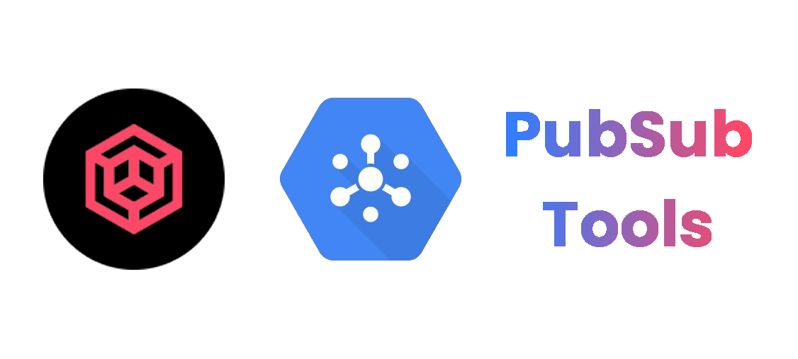

# Introduction

TODO

## Feature highlights

TODO

## Installation

PDM requires Python 3.7+ to be installed. It works on multiple platforms including Windows, Linux and MacOS.

!!! note
    You can still have your project working on lower Python versions, read how to do it [here](usage/project.md#working-with-python-37).

### Recommended installation method

TODO
